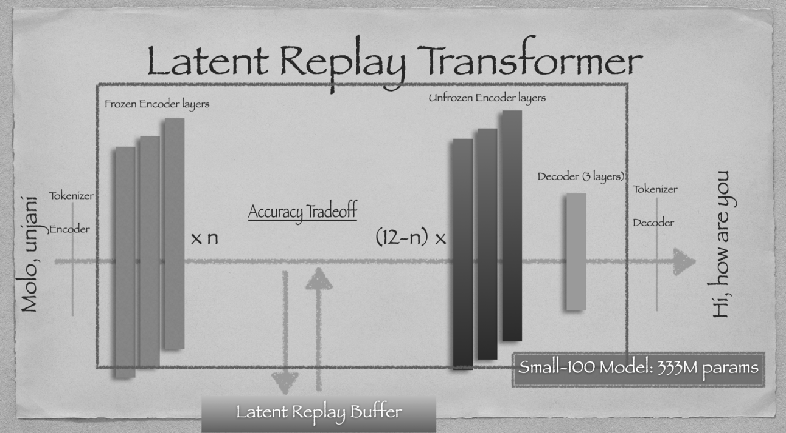
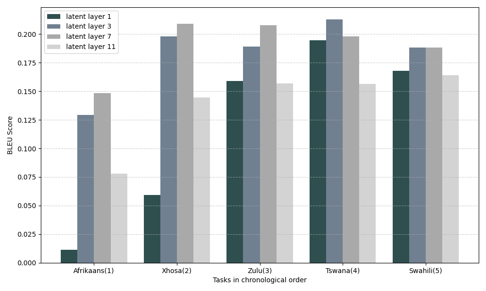

# Combatting Language Forgetting in Low-Resourced Settings with the Latent Replay Transformer

~ By Emmanuel Rassou

## Abstract
Neural machine translation becomes a continual learning challenge as language evolves over time. While Transformer-based models excel at capturing linguistic patterns from large corpora, they require continual updates to adapt to new language use without losing previously acquired knowledge. In this work, we introduce Latent Replay Buffers to the NLP domain for the first time by implementing and fine-tuning our *Latent Replay Transformer*. We conduct initial experiments on low-resource languages and compact models such as Small-100, which are well-suited for deployment in memory- and data-constrained environments. Our findings reveal an intriguing trade-off in the selection of latent activations to store for effective replay. We release our code to support both the Continual Learning and NLP for Low-Resourced Languages communities.

We adapt the Replay Buffer implementation for computer vision in https://github.com/iacobo/generative-latent-replay.

- The custom Avalanche strategy is found in `core/latent_replay_transformer.py`.
- We use the Small-100 model from the `small-100` folder, and the configuration used is defined in `core/main.py`.
- Custom dataloader for Flores-200 in `core/load_flores200.py`.
- Helper scripts for training and inference in `scripts/`
